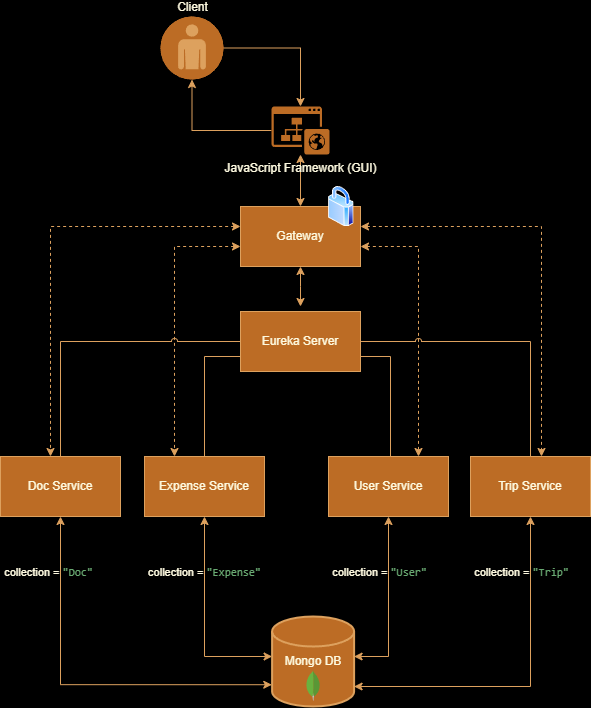

## Architecture

## How to start the service local:

Make sure to be checked out of the branch, where you want to run the service. (So if you want to run the code in Main, make sure, that you are checkedout in your local main)

**MAKE SURE THAT DOCKER DESKTOP IS RUNNING**

Open Git Bash
navigate yourself to the place where you have the project on your PC:

default: cd ~/IdeaProjects/travelexpensemgmt

then copy the code below and paste it into the git bash commandline (**This may take some time running it for the first Time**):

`cd docservice && ./gradlew build && docker build . -t docservice && cd .. && cd expenseservice && ./gradlew build && docker build . -t expenseservice && cd .. && cd tripservice && ./gradlew build && docker build . -t tripservice && cd .. && cd userservice && ./gradlew build && docker build . -t userservice && cd .. && cd gateway && ./gradlew build && docker build . -t gateway && cd .. && cd eurekaserver && ./gradlew build && docker build . -t eurekaserver && cd ..
`

and then this command:

`docker-compose up`

When you can see the containers in Docker Desktop then its ready to use and you call the http-requests.
